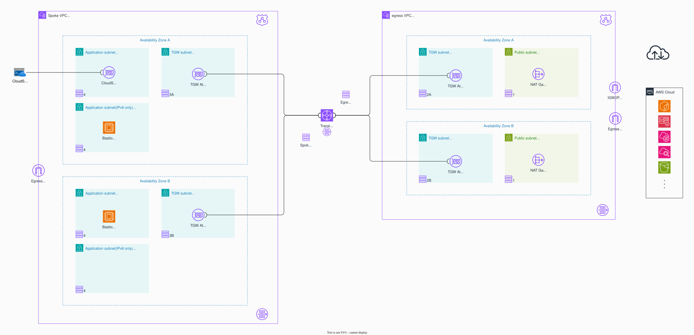

# Study of AWS: Project Bosporus

- Egress VPCの実証実験
  - スポークVPCからのIPv6通信を適切にVPC外のサービス(AWSサービス群や外部サービス)にルートできる
- Terraform環境の実証実験
  - VSCode+DevContainerでTerraform開発環境を構築する

## 実験メモ
- [Terraform](./docs/terraform.md)
- [AWS](./docs/aws.md)
- [Egress VPC](./docs/egressvpc.md)

## 構成図
> [!CAUTION]
> めっちゃ書きかけだし完成させないかもしれない

## References
### Terraform
- [Terraform Languege Documentation](https://developer.hashicorp.com/terraform/language)
- [Terraform CLI Documentation](https://developer.hashicorp.com/terraform/cli)
- [AWS Provider](https://registry.terraform.io/providers/hashicorp/aws/latest/docs)
- [AWS Integration and Automation(aws-ia)](https://github.com/aws-ia)
  - [AWS VPC Module](https://github.com/aws-ia/terraform-aws-vpc)
  - [AWS Hub and Spoke Architecture with AWS Transit Gateway](https://github.com/aws-ia/terraform-aws-network-hubandspoke)
- [21 Terraform Best Practices to Improve Your TF Workflow](https://spacelift.io/blog/terraform-best-practices)
- [一般的なスタイルと構造に関するベスト プラクティス](https://docs.cloud.google.com/docs/terraform/best-practices/general-style-structure?hl=ja)
- [Best practices for using the Terraform AWS Provider](https://docs.aws.amazon.com/prescriptive-guidance/latest/terraform-aws-provider-best-practices/introduction.html)([ja](https://docs.aws.amazon.com/ja_jp/prescriptive-guidance/latest/terraform-aws-provider-best-practices/introduction.html))

### AWSおよびHub&Spork Network Toporogy
- [エグレスVPC](https://docs.aws.amazon.com/ja_jp/managedservices/latest/onboardingguide/networking-vpc.html)
- [[技術検証]Ingress VPCとEgress VPCを一つにできるか](https://iret.media/76370)
- [AWS のネットワークで 知っておくべき10のこと](https://pages.awscloud.com/rs/112-TZM-766/images/10-things-network.pdf)
- [IPv6 on AWS](https://docs.aws.amazon.com/whitepapers/latest/ipv6-on-aws/IPv6-on-AWS.html)
- [Dual Stack and IPv6-only Amazon VPC Reference Architectures](https://d1.awsstatic.com/architecture-diagrams/ArchitectureDiagrams/IPv6-reference-architectures-for-AWS-and-hybrid-networks-ra.pdf)
- [AWSでIPv6を使う場合のリファレンスアーキテクチャを読み解く：準備編](https://business.ntt-east.co.jp/content/cloudsolution/ih_column-42.html)
- [AWSでIPv6を使う場合のリファレンスアーキテクチャを読み解く：前編](https://business.ntt-east.co.jp/content/cloudsolution/ih_column-45.html)
- [AWSでIPv6を使う場合のリファレンスアーキテクチャを読み解く：後編](https://business.ntt-east.co.jp/content/cloudsolution/ih_column-50.html)
- [Centralizing outbound Internet traffic for dual stack IPv4 and IPv6 VPCs](https://aws.amazon.com/blogs/networking-and-content-delivery/centralizing-outbound-internet-traffic-for-dual-stack-ipv4-and-ipv6-vpcs/)([assets](https://github.com/aws-samples/ipv6-nat64-66-blog-post-cloudformation))